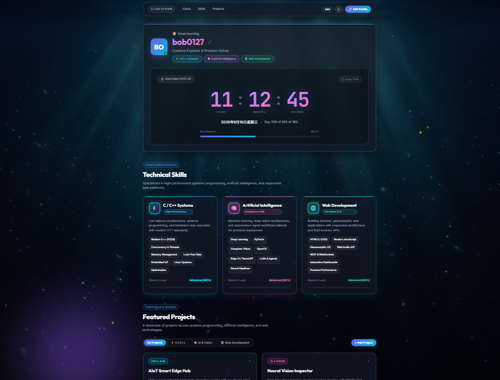

# bob0127 • Personal Hub & Engineering Portfolio

A sleek, responsive personal engineering portfolio and dashboard featuring an **Ocean Abyss aesthetic**, a precision real-time digital clock, dedicated **Technical Skills Matrix** (C/C++, AI, Web Development), an interactive **Featured Projects Showcase**, and productivity widgets.

Built with pure vanilla web technologies (HTML5, CSS3, ES6+ JavaScript) with zero external build dependencies or npm packages required.

---

## 🌐 Live Demo

### 🔗 Quick Launch
- **Online Deployment**: Ready for zero-config hosting on GitHub Pages:
  ```text
  https://bob0127.github.io/AIOT/
  ```

### 🖥️ Interface Preview



---

## ✨ Features

### 1. 🌊 Ocean Abyss Aesthetic & Generated Background
- **Atmospheric Wallpaper**: Features a cinematic deep ocean background (`ocean_bg.jpg`) with ethereal light rays and bioluminescent ambient glow.
- **Glassmorphic Panels**: Frosted ocean-depth cards with subtle cyan rim lighting (`backdrop-filter: blur(20px)`).
- **5 Curated Themes**:
  - **Deep Ocean** *(Default)*: Bioluminescent aqua and cyan over oceanic depths.
  - **Obsidian Dark**: Sleek obsidian slate with indigo accents.
  - **Aurora Borealis**: Forest teal and emerald tones with glowing mint hues.
  - **Neon Cyber**: Deep violet and magenta with electric yellow highlights.
  - **Frosted Daylight**: Clean, high-contrast light mode with glassmorphism.

### 2. ⚡ Core Technical Skills Matrix
Three dedicated engineering domain showcases with proficiency metrics and interactive skill chips:
- **C / C++ Systems (95%)**: Modern C++ (C++17/20), Concurrency & Multi-threading, Memory Allocation & Lock-Free data structures, Embedded IoT, Linux Systems Programming, and low-latency performance optimization.
- **Artificial Intelligence (92%)**: Deep Learning, Neural Network architectures, PyTorch, Computer Vision & OpenCV, Edge AI / TensorRT inference, LLM agent integration, and data processing pipelines.
- **Web Development (94%)**: Semantic HTML5, Vanilla CSS3 Glassmorphism, Modern ES6+ JavaScript, Web Audio API synthesis, REST & WebSockets, and responsive UX design.

### 3. 💼 Featured Projects Showcase
- **Category Filter Tabs**: Smooth real-time filtering between `All Projects`, `⚡ C / C++`, `🧠 AI & Vision`, and `🌐 Web Development`.
- **Pre-Loaded Projects**:
  1. *AIoT Smart Edge Hub* (C++20, Edge AI, TensorRT, IoT, Linux)
  2. *Neural Vision Inspector* (Python, PyTorch, OpenCV, WebSockets)
  3. *High-Performance Memory Pool* (C++, Lock-Free, Systems Programming)
  4. *Dynamic Personal Hub & Clock* (HTML5, CSS3, JavaScript, Web Audio)
  5. *Autonomous Edge Pathfinding Agent* (C++, PyTorch, Reinforcement Learning)
  6. *Sensor Telemetry Web Suite* (JavaScript, Canvas API, WebSockets)
- **Custom Project Creation**: Interactive modal dialog allows you to add custom projects with title, domain category, description, tech tags, and repository links—automatically stored in `localStorage`.

### 4. 🕒 High-Precision Live Clock
- **Digital Display**: Tabular digits (`JetBrains Mono`) tracking hours, minutes, and seconds.
- **12H / 24H Format Toggle**: Switch dynamically between 12-hour (with AM/PM indicator) and 24-hour modes.
- **Full Date & Day Metrics**: Displays full date (`Wednesday, September 16, 2026`) and day of year (`Day 259 of 365`).
- **Day Progress Meter**: Real-time visual progress bar and percentage displaying the fraction of the 24-hour day elapsed.
- **Local Timezone & Quick Copy**: Automatically resolves your local timezone (e.g., `Asia/Shanghai (UTC+8)`) and provides a one-click button to copy a formatted timestamp.

### 5. 🧭 Bento Grid Productivity Widgets
- **Global Time Zones**: Synchronized clocks for London, New York, Tokyo, and Sydney with automatic day-difference tags.
- **Quick Scratchpad**: Instant notepad for thoughts, daily goals, and tasks with debounced auto-saving to `localStorage`.
- **Fast Access Shortcuts**: Customizable bookmarks with modal to add or remove links.
- **Ocean Ambience Generator**: Built-in sound generator using the browser's native **Web Audio API** to synthesize gentle ocean waves and rain noise with real-time volume control.

---

## 📁 Project Structure

```text
AIOT/
├── index.html       # Semantic HTML5 layout, accessible modal dialogs, and SVG icons
├── style.css        # Ocean design tokens, glassmorphism, responsive grid, and themes
├── app.js           # Real-time clock, projects filter, Web Audio API, and state storage
├── ocean_bg.jpg     # Generated high-resolution oceanic underwater background wallpaper
├── preview.png      # Dashboard interface screenshot / live preview
└── README.md        # Documentation and usage guide
```

---

## 🚀 Getting Started

### Option 1: Direct File Opening
Double-click or open [index.html](index.html) in any modern web browser (Google Chrome, Microsoft Edge, Mozilla Firefox, Safari, Brave). No installation or server needed!

### Option 2: Local Web Server (Optional)
If you prefer serving via HTTP:

```bash
# Using Python
python -m http.server 8000

# Using Node (npx)
npx serve .
```
Then visit `http://localhost:8000` in your browser.

---

## 🛠️ Customization & Extensibility

- **Profile**: Customize your name, bio, and location by clicking on your name or via the **Edit Profile** button.
- **Projects**: Use the **+ Add Project** button to add new portfolio items directly from the UI.
- **Timezones**: Modify the monitored world clock cities in `WORLD_ZONES` in `app.js`.
- **Styles & Themes**: All color tokens, glow intensities, and glass properties are defined in `:root` and `[data-theme]` selectors in `style.css`.

---

## 📄 License
MIT License &bull; Free to customize and make your own!
